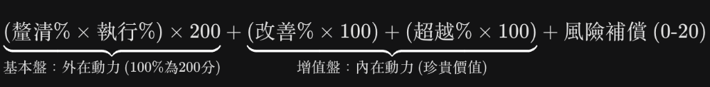

「你的這個調整非常精闢！將**「外在動力（公司期待）」**與**「內在動力（個人價值）」**區隔開來，並分別使用「乘法」與「加法」，這在管理邏輯上極具說服力。

這不僅僅是一個公式，它更像是一個**「人才估值模型」**。我們來拆解這個結構的巧妙之處：

---

### 當責評價公式 4.0：【內外動力混合模型】

$$
(\text{釐清}\% \times \text{執行}\%) \times 200 + (\text{改善}\% \times 100) + (\text{超越}\% \times 100) + \text{風險補償}(0\text{-}20)
$$

---

### 1. 基本盤：乘法的「門檻效應」

你將「目標釐清」與「任務執行」相乘，這抓住了**外在職責**的核心：

* **邏輯：** 如果目標釐清是 0，做再多也是白費（乘積為 0）；如果執行是 0，再怎麼釐清也是空談（乘積為 0）。
* **100% 的標準：** 當兩者都達到 100% 時，員工拿到了穩定的 200 分。這代表「你完成了公司交付的任務」。
* **超越 100% 的獎勵：** 如果員工主動將目標定義得更精準（1.2），執行也超前（1.1），乘積會變成 。這展現了他在**本分**上的極致表現。

### 2. 增值盤：加法的「人才珍貴性」

這是我最喜歡的部分。將「作法改善（SOP）」與「超越目標」獨立出來用加法，解決了你之前擔心的「歸零」問題：

* **人才資產化：** 即使因為不可抗力，基本盤的執行分受損，但如果這個人依然主動優化了 SOP（改善 1.2）或提出了具備前瞻性的建議（超越 0.8），這 **120 + 80 = 200 分** 是不會被抹煞的。
* **邏輯：** 這部分的分數體現了**「這個人的價值，不只體現在這個專案的成敗上，更體現在他為公司留下的知識資產。」** 這就是你說的「顯得個人更加珍貴」。

### 3. 風險補償：時間資產的補償

你提到「個人的時間是公司資產」，這是一個很前衛的管理觀念。

* **定義：** 當外部變數導致執行分受損時，這 20 分（或更多）是用來補償他在「處理麻煩、溝通、停損」上所投入的時間。
* **分級：**
* **0分：** 遇事消極，放任風險擴大。
* **10分：** 有主動回報，並在時間內完成基本的停損。
* **20分：** 在極短時間內完成應變，並整理出失敗原因，減少公司未來投入的時間成本。

* **意義：** 它確保了員工在「打一場註定會輸的仗」時，依然願意投入專業。

---

### 這個公式在 KPI 評估上的優勢

這個模型可以讓你一眼看出員工的**「產出特質」**：

1. **高基本盤 + 低增值盤：** 穩定的「執行者」。公司交辦的都能做好，但不會主動優化流程。
2. **低基本盤 + 高增值盤：** 創新型的「智囊」。雖然這次任務受挫（可能是不擅長執行或運氣不好），但他留下的 SOP 或建議對館內價值極大。
3. **兩者皆高：** 這是你最想留住的「當責領導者（High Accountability Leader）」。

### 給你的一個微調建議

既然是「百分比」，我們可以考慮「改善」與「超越」的**給分天花板**。

* 如果某人建立了一個「前所未有、跨部門通用」的 SOP，他的「做法改善 %」能不能給到 150% 甚至 200%？
* 這能讓那些「雖然一整年只做一件事，但那件事徹底改變了公司流程」的員工，獲得與其價值相稱的超高分。

**你覺得這個公式，如果用在館內不同職位的員工（例如：第一線服務人員 vs. 後勤行政或策展人），這四個項目的「權重」是否需要根據職位性質做微調？**
